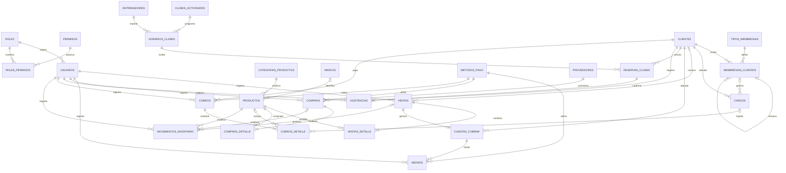

# Diseño de seguridad y procesos

## 1. Alcance de la fase

Esta fase completa el diseño de las tablas y los modelos necesarios para los procesos indicados en el mandato. La aplicación continúa siendo Windows Forms y no se incluye un dashboard.

El script `04_configuracion_procesos.sql` debe ejecutarse después de `02_usuarios_roles.sql` y `03_mantenimientos.sql`.

## 2. Tablas de apoyo

### metodos_pago

Guarda los métodos que podrán seleccionarse al registrar cobros, abonos y compras. Cada método tiene nombre, descripción y estado.

### permisos

Representa las ventanas o funciones a las que puede acceder un rol. La clave permite identificar el permiso desde el programa sin depender del texto visible.

### roles_permisos

Relaciona roles y permisos. Su clave primaria está formada por `id_rol` e `id_permiso`, evitando asignaciones repetidas.

### marcas

Permite normalizar el campo `id_marca` sugerido para Productos. La relación es opcional para no impedir el uso de productos que todavía no tengan una marca registrada.

## 3. Membresías, cargos y cobros

### membresias_clientes

Relaciona un cliente con un tipo de membresía. Guarda las fechas de inicio y vencimiento, el precio aplicado y el estado. `id_membresia_anterior` permite reconocer una renovación y conservar el historial sin modificar la membresía anterior.

### cargos

Registra la obligación de pago de un cliente. El identificador se genera automáticamente y funciona como número de cargo. El estado se obtiene con reglas sencillas:

- Saldo igual a cero: pagado.
- Saldo mayor que cero y fecha vigente: pendiente.
- Saldo mayor que cero y fecha vencida: vencido.
- Estado desactivado: inactivo.

### cobros

Guarda la cabecera del cobro con cliente, usuario, método de pago, fecha y total.

### cobros_detalle

Permite incluir servicios, productos y pagos adelantados en un mismo cobro. Las restricciones aseguran que un producto tenga `id_producto`, que un servicio tenga `id_cargo` y que un pago adelantado no dependa de ninguno de los dos.

## 4. Ventas, crédito y abonos

### ventas

Guarda los campos sugeridos en el mandato: fecha, cliente, usuario, tipo de pago, subtotal, descuento, impuesto, total y estado. El tipo de pago solamente acepta contado o crédito.

### ventas_detalle

Relaciona la venta con los productos vendidos y conserva cantidad, precio, descuento y subtotal.

### cuentas_cobrar

Se crea únicamente para una venta a crédito. `id_venta` es único, por lo que una venta no puede generar más de una cuenta por cobrar.

### abonos

Registra los pagos parciales de una cuenta por cobrar e identifica el método de pago y el usuario que lo registró.

## 5. Compras e inventario

### compras

Guarda proveedor, usuario, método de pago, fecha y totales. No se crea ninguna cuenta por pagar porque el mandato indica que las compras serán solamente al contado.

### compras_detalle

Guarda los productos, cantidades, precios y subtotales de cada compra.

### movimientos_inventario

Registra entradas y salidas de productos. Una entrada puede relacionarse con una compra y una salida puede relacionarse con una venta.

## 6. Reservas y asistencia

### reservas_clases

Relaciona un cliente con un horario y una fecha específica. La restricción única evita registrar dos veces al mismo cliente en la misma clase y fecha.

### asistencias

Registra la fecha y hora de asistencia de un cliente. Puede relacionarse con una reserva, pero también permite registrar una asistencia general al gimnasio. Una reserva solo puede producir una asistencia.

## 7. Diagrama Entidad-Relación

## 8. Relaciones del modelo

### Relaciones 1:N

- Un cliente puede tener muchas membresías.
- Un cliente puede tener muchos cargos y cobros.
- Una venta puede contener muchos detalles.
- Una compra puede contener muchos detalles.
- Una cuenta por cobrar puede recibir muchos abonos.
- Un producto puede tener muchos movimientos de inventario.

### Relaciones N:M

- Roles y permisos se relacionan mediante `roles_permisos`.
- Clientes y horarios de clases se relacionan mediante `reservas_clases`.

### Relaciones 1:1

- Una venta a crédito puede tener una sola cuenta por cobrar porque `cuentas_cobrar.id_venta` es único.
- Una reserva puede tener una sola asistencia porque `asistencias.id_reserva` es único.

## 9. Integridad y normalización

Todas las tablas tienen clave primaria. Las relaciones utilizan claves foráneas y los valores numéricos tienen restricciones para impedir cantidades, precios, saldos o totales inválidos.

Los datos repetibles se separan en tablas de detalle y las relaciones N:M utilizan tablas intermedias. Los nombres de clientes, productos, proveedores, métodos y usuarios no se copian en las transacciones; se obtienen mediante sus claves foráneas. Esta separación permite explicar que el diseño evita duplicaciones y mantiene la Tercera Forma Normal.

## 10. Relación con el código

Los modelos que representan estas tablas se encuentran en la carpeta `Modelos/`. Los repositorios que ejecutan las consultas SQL parametrizadas están en `Datos/`. Los formularios de mantenimiento permiten crear, editar y cambiar el estado de cada entidad. Los formularios de consulta muestran los registros filtrados por texto de búsqueda.

Los movimientos (ventas, compras, cobros, abonos, reservas, asistencias, inventario y generación de cargos) utilizan transacciones de PostgreSQL para garantizar que el stock, los saldos y los cupos se actualicen de forma consistente. Los reportes consultan las tablas y presentan los resultados dentro de la aplicación.

Los permisos se organizan en cinco módulos: Mantenimientos, Movimientos, Reportes, Consultas y Configuración. El rol ADMIN recibe todos los permisos automáticamente. Los demás roles solo ven las secciones que tienen asignadas.

## 11. Explicación para el profesor

La base distingue los datos principales de los movimientos. La venta y la compra utilizan una cabecera para la información general y un detalle para sus productos. Los cargos conservan el monto original y el saldo pendiente. Las membresías conservan el historial de asignaciones y renovaciones. Las claves foráneas impiden relacionar registros inexistentes y los índices aceleran las consultas solicitadas por cliente y por fecha.

El diseño completo incluye 27 tablas, 41 permisos, consultas parametrizadas y contraseñas protegidas con hash y sal. Cada pantalla de mantenimiento respeta los límites de PostgreSQL y valida los datos antes de enviarlos a la base de datos.
